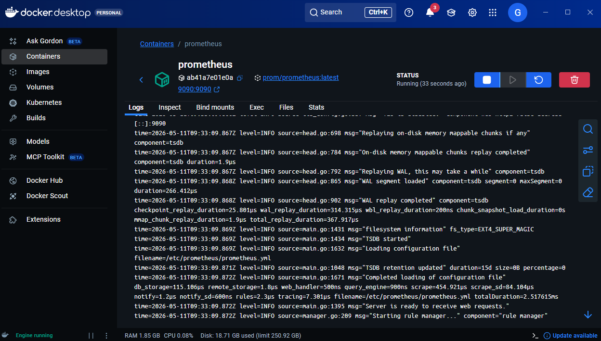
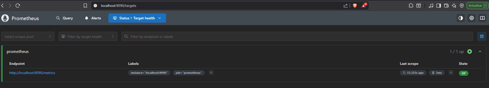
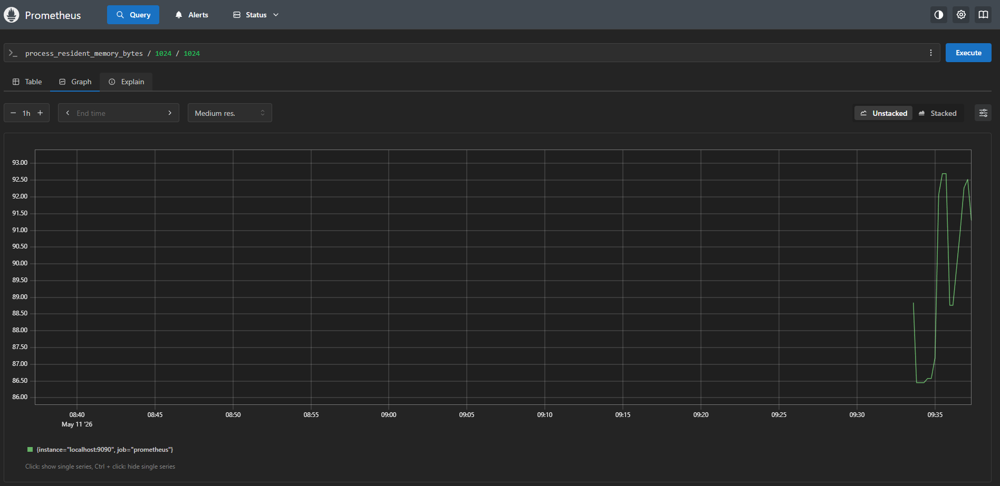
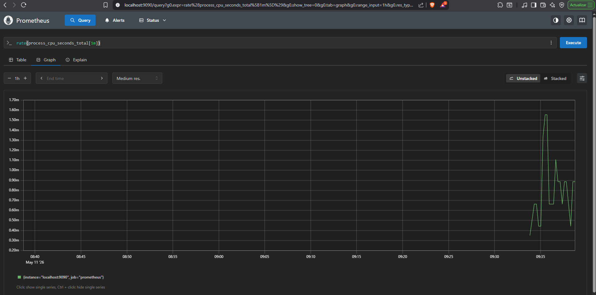

# Ejercicio 1 — Prometheus en local con Docker

## Levantamos Prometheus

Levantamos el contenedor con la imagen de Prometheus:

```bash
docker run -d \
  --name prometheus \
  -p 9090:9090 \
  -v %cd%/prometheus.yml:/etc/prometheus/prometheus.yml \
  prom/prometheus
```

El volumen apunta al archivo de configuración de Prometheus, para que el propio Prometheus se monitorice a si mismo.



El cliente web está disponible en **http://localhost:9090**.

---

## Verificamos el target

En la UI **Status → Targets** y comprobamos que el job `prometheus` aparece como `UP`.



---

## Queries

### Memoria utilizada

En la pestaña **Graph** del cliente web, ejecutamos:

```promql
process_resident_memory_bytes
```

Esta métrica muestra la memoria residente (RSS) en bytes del proceso de Prometheus.

También puedes consultar en MB:

```promql
process_resident_memory_bytes / 1024 / 1024
```



### CPU utilizada

```promql
rate(process_cpu_seconds_total[1m])
```

Esta métrica muestra la tasa de segundos de CPU consumidos por Prometheus en el último minuto.

**Nota**: Sin utilizar una ventana, solo el contador, obtendríamos una línea que solo sube, el total acumulado desde el inicio. No te dice nada útil sobre el uso actual porque no tiene referencia temporal. Por eso utilizamos `rate()`



---

## Paramos y eliminamos el contenedor

```bash
docker stop prometheus && docker rm prometheus
```
