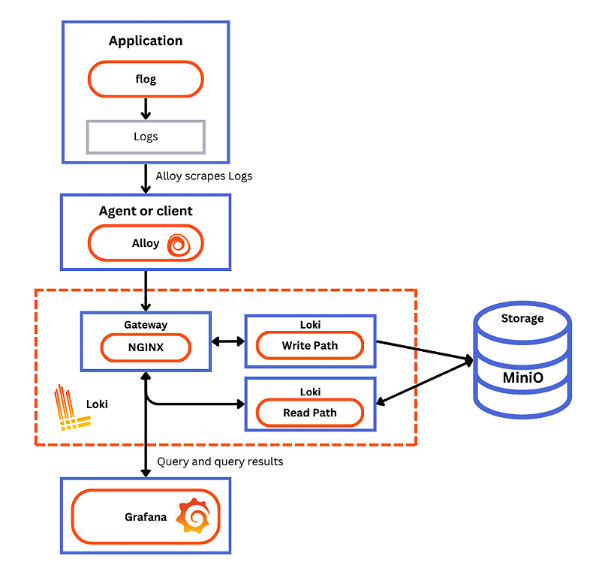
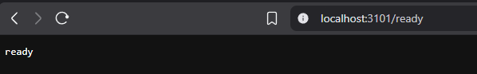
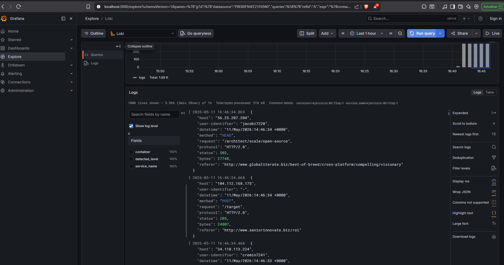

# Ejercicio 3 — Contenido de la carpeta `01-start-up-loki`

La carpeta contiene un setup completo de **Grafana Loki en modo distribuido** (lectura, escritura y backend separados) usando Docker Compose. Los tres ficheros que la componen son:

```
01-start-up-loki/
├── docker-compose.yaml       # Orquestación de todos los servicios
├── loki-config.yaml          # Configuración de Loki
└── alloy-local-config.yaml   # Configuración del agente recolector de logs (Grafana Alloy)
```

---

## `docker-compose.yaml`

Define la red `loki` y los siguientes servicios:

### Servicios de Loki (modo simple-scalable)

Loki se divide en tres roles independientes para escalar cada componente de forma separada:

| Servicio | Imagen | Rol | Puerto |
|---|---|---|---|
| `read` | `grafana/loki:latest` | Maneja las **consultas** de logs (query frontend + querier) | `3101:3100` |
| `write` | `grafana/loki:latest` | Recibe y almacena los **logs entrantes** (distributor + ingester) | `3102:3100` |
| `backend` | `grafana/loki:latest` | Tareas de fondo: **compactación** e índices (compactor + ruler) | `3100` interno |

Los tres comparten el mismo `loki-config.yaml` y se coordinan a través de **memberlist** (protocolo gossip) en el puerto `7946`.

### `minio`

- Imagen: `minio/minio`
- Actúa como **almacenamiento de objetos compatible con S3** (sustituye a S3 real en local).
- Crea automáticamente los buckets `loki-data` (logs) y `loki-ruler` (reglas).
- Credenciales: usuario `loki` / contraseña `supersecret`.
- Puerto interno: `9000`.

### `gateway`

- Imagen: `nginx:latest`
- Actúa como **proxy/balanceador** en el puerto `3100`.
- Enruta las peticiones de escritura al servicio `write` y las de lectura al servicio `read`.
- Rutas relevantes:
  - `POST /loki/api/v1/push` → `write:3100`
  - `GET /loki/api/.*` → `read:3100`
  - `POST /api/prom/push` → `write:3100`

### `grafana`

- Imagen: `grafana/grafana:latest`
- Puerto: `3000:3000`.
- Se provisiona automáticamente con un **datasource de Loki** apuntando al gateway.
- Acceso anónimo habilitado con rol `Admin` (útil para desarrollo local).
- Header `X-Scope-OrgID: tenant1` configurado para multitenancy.

### `alloy`

- Imagen: `grafana/alloy:latest`
- **Agente recolector de logs**. Descubre contenedores Docker y reenvía sus logs a Loki.
- Monta `alloy-local-config.yaml` y el socket de Docker `/var/run/docker.sock`.
- Puerto de administración: `12345`.

### `flog`

- Imagen: `mingrammer/flog`
- **Generador de logs ficticios** en formato JSON con un intervalo de 200 ms.
- Sirve para poblar Loki con datos de prueba inmediatamente.

### Diagrama de flujo



---

## `loki-config.yaml`

Configura el comportamiento de todos los nodos Loki. Secciones principales:

### `server`
```yaml
http_listen_address: 0.0.0.0
http_listen_port: 3100
```
Todos los nodos escuchan en el mismo puerto y se aceptan conexiones desde cualquier ip.

### `memberlist`
```yaml
join_members: ["read", "write", "backend"]
gossip_interval: 2s
bind_port: 7946
```
Protocolo **gossip** que coordina los tres nodos. Se usan los nombres de servicio Docker como seed members. El intervalo de gossip es de 2 s y define el puerto 7946 para la comunicación interna.

### `schema_config`
```yaml
configs:
  - from: 2023-01-01
    store: tsdb          # motor de índices
    object_store: s3     # almacenamiento de chunks
    schema: v13
    index:
      prefix: index_
      period: 24h
```
Define el esquema de almacenamiento: índices en **TSDB** y chunks en **S3** (MinIO), con rotación diaria de índices.

### `common`
```yaml
replication_factor: 1
compactor_address: http://backend:3100
storage:
  s3:
    endpoint: minio:9000
    bucketnames: loki-data
    access_key_id: loki
    secret_access_key: supersecret
    s3forcepathstyle: true
ring:
  kvstore:
    store: memberlist
```
Configuración compartida: almacenamiento S3/MinIO, factor de replicación 1 (solo un nodo de cada tipo), y KV store basado en memberlist para la coordinación de anillos internos (ingester ring, etc.).

### `ruler`
```yaml
storage:
  s3:
    bucketnames: loki-ruler
```
Las reglas de alertas de Loki se almacenan en el bucket `loki-ruler` de MinIO.

### `compactor`
```yaml
working_directory: /tmp/compactor
```
El compactador consolida los índices TSDB en el nodo `backend` para mejorar el rendimiento de las consultas.

---

## `alloy-local-config.yaml`

Configura **Grafana Alloy** (sucesor de Promtail/Agent) para recopilar logs de Docker y enviarlos a Loki. Usa el lenguaje de configuración River.

### `discovery.docker "flog_scrape"`
```river
host             = "unix:///var/run/docker.sock"
refresh_interval = "5s"
```
Descubre todos los contenedores Docker activos conectándose al socket de Docker. Se refresca cada 5 s.

### `discovery.relabel "flog_scrape"`
```river
rule {
  source_labels = ["__meta_docker_container_name"]
  regex         = "/(.*)"
  target_label  = "container"
}
```
Aplica una **regla de re-etiquetado**: extrae el nombre del contenedor del metadato Docker y lo añade como label `container` en los logs. Esto permite filtrar en Grafana por nombre de contenedor.

### `loki.source.docker "flog_scrape"`
```river
host          = "unix:///var/run/docker.sock"
targets       = discovery.docker.flog_scrape.targets
forward_to    = [loki.write.default.receiver]
relabel_rules = discovery.relabel.flog_scrape.rules
```
Recoge los logs de los contenedores descubiertos, aplica las reglas de re-etiquetado y los reenvía al componente de escritura.

### `loki.write "default"`
```river
endpoint {
  url       = "http://gateway:3100/loki/api/v1/push"
  tenant_id = "tenant1"
}
```
Envía los logs al gateway de nginx en el puerto `3100`. El header `X-Scope-OrgID: tenant1` habilita el multitenancy de Loki.

---

## Cómo levantar el entorno

```bash
docker compose up -d
```

Vemos que tenemos el entorno ready:



Accedemos a Grafana en **http://localhost:3000** y exploramos los logs en **Explore → Loki**.  
Query de prueba para ver los logs de flog:

```logql
{container="ejercicio-03-flog-1"} |= ``
```

