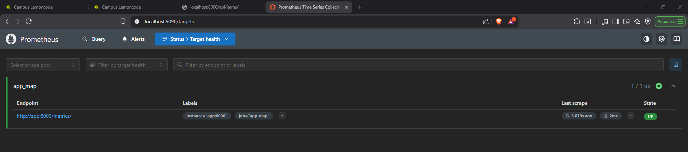

# Ejercicio 5.1 — Docker Compose con Prometheus y app FastAPI

## Punto 1 — Servicio de la app en Docker Compose

Se creó un `Dockerfile` para construir la imagen de la app FastAPI y se añadió como primer servicio en `compose.yaml`.

### `Dockerfile`

```dockerfile
FROM python:3.12-slim

WORKDIR /app

COPY app_map/requirements.txt .
RUN pip install --no-cache-dir -r requirements.txt

COPY app_map/ ./app_map/
COPY app_map/statics/ ./statics/

EXPOSE 8000

CMD ["fastapi", "run", "app_map/main.py", "--host", "0.0.0.0", "--port", "8000"]
```

- Imagen base `python:3.12-slim` para mantener la imagen ligera.
- Se copian primero solo las dependencias para aprovechar la caché de capas de Docker.
- `statics/` se copia en la raíz del `WORKDIR` porque `main.py` busca la carpeta con ruta relativa `"statics"`.
- Se usa `fastapi run` (wrapper de uvicorn en modo producción).

### `compose.yaml` — servicio `app`

```yaml
services:
  app:
    build:
      context: .
      dockerfile: Dockerfile
    ports:
      - "8000:8000"
```

Una vez levantado, la app queda disponible en `http://localhost:8000/api/items/`:


---

## Punto 2 — Librería cliente de Prometheus

Se añadió `prometheus-client` a `requirements.txt` y se instrumentó `main.py` para exponer las métricas por defecto en `/metrics/`.

### `main.py`

```python
from fastapi import FastAPI
from fastapi.staticfiles import StaticFiles
from prometheus_client import make_asgi_app
from .api.endpoints import router as item_router

app = FastAPI()

app.include_router(item_router)

metrics_app = make_asgi_app()
app.mount("/metrics", metrics_app)

app.mount('/', StaticFiles(directory="statics", html=True), name="static")
```

`make_asgi_app()` crea una sub-aplicación ASGI que expone todas las métricas por defecto del proceso Python (GC, memoria, CPU, info de versión). Se monta **antes** que el `StaticFiles` de `/` para que este no intercepte la ruta.

> **Nota:** Debido a cómo Starlette gestiona los mounts internamente, la URL funcional es `http://localhost:8000/metrics/` (con barra final). Prometheus se configura para apuntar a esa ruta con `metrics_path`.

---

## Punto 3 — Servicio Prometheus con target a la app

Se añadió el servicio `prometheus` al `compose.yaml` y se creó `prometheus.yml` con el target apuntando al servicio `app`.

### `prometheus.yml`

```yaml
global:
  scrape_interval: 15s

scrape_configs:
  - job_name: "app_map"
    metrics_path: "/metrics/"
    static_configs:
      - targets: ["app:8000"]
```

- `targets: ["app:8000"]` usa el nombre del servicio Docker en lugar de `localhost`, ya que dentro de la red de Docker Compose los contenedores se resuelven por nombre.
- `metrics_path: "/metrics/"` sobreescribe el path por defecto `/metrics` para apuntar a la ruta correcta de la sub-app ASGI.

### `compose.yaml` completo

```yaml
services:
  app:
    build:
      context: .
      dockerfile: Dockerfile
    ports:
      - "8000:8000"

  prometheus:
    image: prom/prometheus:latest
    ports:
      - "9090:9090"
    volumes:
      - ./prometheus.yml:/etc/prometheus/prometheus.yml
    depends_on:
      - app
```

---

## Punto 4 — Verificación del target

Para levantar el entorno:

```bash
docker compose up -d
```

Acceder a `http://localhost:9090/targets` para verificar que el target `app_map` está en estado **UP**.

)

Una vez alcanzado, se pueden consultar métricas por defecto como:

| Métrica | Descripción |
|---|---|
| `python_gc_objects_collected_total` | Objetos recolectados por el GC de Python |
| `process_resident_memory_bytes` | Memoria RAM usada por el proceso |
| `process_cpu_seconds_total` | CPU acumulada consumida |
| `python_info` | Versión de Python en uso |

